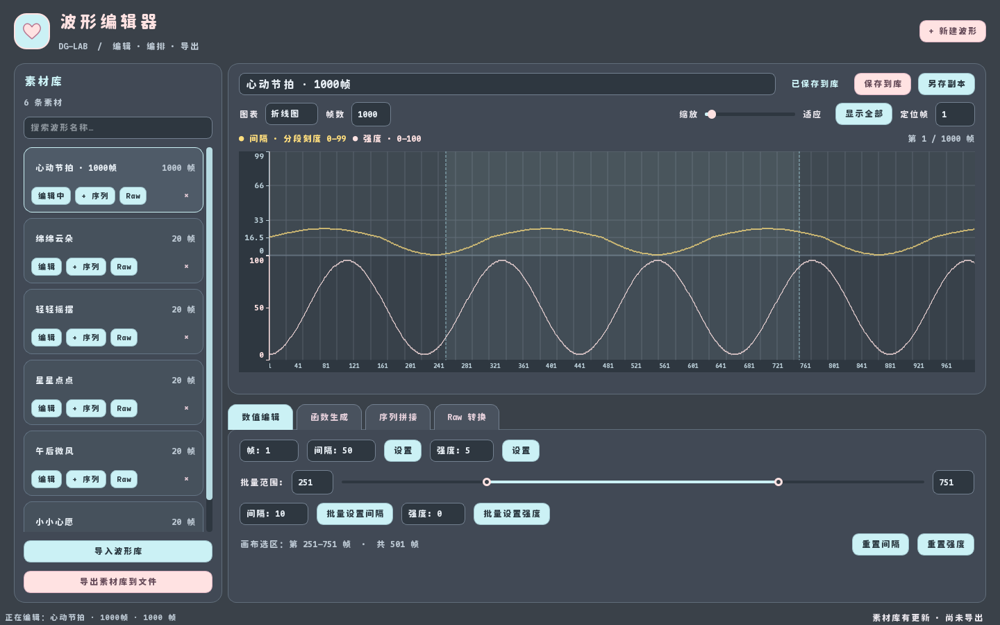

# DG-LAB-Wave-Editer

为 [DG-Lab-Coyote-Game-Hub](https://github.com/hyperzlib/DG-Lab-Coyote-Game-Hub) 设计的波形可视化编辑工具，支持手绘、函数生成、素材拼接和 JSON5 导入导出。

粉蓝配色、圆角卡片与分区工作台，支持完整的 1000 帧编辑。Windows 单文件 exe 请从 [GitHub Releases](https://github.com/kswag72/DG-LAB-Wave-Editer/releases) 下载。



## 功能

- **手绘波形** — 鼠标拖动直接绘制间隔/强度曲线
- **1000 帧编辑** — 单条波形支持 1–1000 帧，精确编辑、批量设置、函数生成和平滑覆盖完整长度
- **分段纵轴** — 上方间隔曲线以 0–99 刻度显示：10/50/130/500/1000 对应 0/16.5/33/66/99，段内线性插值；鼠标绘制反向换算为原始间隔
- **保存与副本** — 保存已加载素材时更新原条目并保留 ID；“另存副本”创建新 ID，随后继续编辑副本
- **长波形导航** — 横轴缩放、显示全部、按帧定位；当前帧与编辑选区在画布中高亮
- **分区工作台** — 可调宽度的素材侧栏、名称搜索、四个工具页和独立的编辑/导出状态提示
- **函数生成** — 10 种函数（正弦/方波/锯齿/三角/幂/多项式/指数/对数/衰减/S形），支持周期、振幅、指数、系数、偏移参数
- **批量设置** — 双端范围滑条选区，一键填充间隔或强度
- **素材拼接** — 多波形 + 静默间隔拼接为完整序列
- **JSON5 导入导出** — 拖入 `pulse.json5` 导入，导出为 DG-Lab pulse 格式
- **Raw 格式转换** — raw 字符串与 expectedV3 波形格式双向转换，支持导入/导出面板，素材库内可多选波形批量导出
- **Raw 批量选择** — 素材卡片的 Raw 按钮切换选中状态（黄色高亮），Raw 工具页显示已选数量并批量导出字符串
- **多种图表类型** — 折线图、面积图、散点图、阶梯图四种显示模式切换
- **波形名称编辑** — 波形库中的波形名称支持直接点击修改
- **帧编号标签** — 画布下方显示从 1 起算的帧编号，标签密度随缩放调整

## 快速开始

需要 Python 3.10+。

```bash
git clone https://github.com/kswag72/DG-LAB-Wave-Editer.git
cd DG-LAB-Wave-Editer
python -m venv .venv

# Windows PowerShell:
.\.venv\Scripts\Activate.ps1
# Windows CMD:
.venv\Scripts\activate.bat

pip install -r configs/requirements.txt
python -m src
```

从项目根目录运行以上命令；新环境单独放在 `.venv/`，不要把源代码放入虚拟环境内部。已有的混放目录无需搬动或重建。

开发规则和已知问题见 [AGENTS.md](AGENTS.md)，模块说明见 [开发手册](docs/DEVELOPMENT.md)。

### 编辑和保存

“帧数”控制当前波形长度，最大 1000 帧；界面上的帧编号从 1 起算，内部索引仍从 0 起算。临时缩短再扩展会保留同一条波形的尾部数据；按当前长度保存时只保存当前帧数。切换素材后再扩展，新增部分使用默认间隔 10、强度 0，不混入上一条素材的数据。

“保存到库”更新当前条目；新建波形首次保存后，重复保存仍更新同一条。“另存副本”保留原条目，并把当前编辑对象切换到带新 ID 的副本。保存到库是内存操作，需要点击“导出素材库到文件”写入文件。画布标题栏提示尚未保存的编辑，底部状态栏提示尚未导出的素材库更新；切换素材、新建或关闭窗口时可以保存、放弃或取消。

左侧搜索框按名称筛选素材，拖动侧栏边界可调整宽度。画布上方可缩放、显示整条波形或定位指定帧；下方工具页分别提供数值编辑、函数生成、序列拼接和 Raw 转换。批量范围和函数范围会在画布中高亮，小窗口下工具页支持滚动。数值框支持直接键入和方向键微调。

| 快捷键 | 操作 |
| --- | --- |
| Ctrl+S | 保存当前波形到素材库 |
| Ctrl+Shift+S | 另存副本 |
| Ctrl+O | 导入波形库 |
| Ctrl+E | 导出素材库到文件 |
| Ctrl+0 | 显示完整波形 |

超过 1000 帧的已有素材仍保留在素材库中，可按现有流程导出完整长度；加载画布时会提示超限，不截断，也不替换正在编辑的内容。上限针对单条画布编辑，未改动序列拼接导出的长度规则。格式编码方面的既有局限见 [AGENTS.md](AGENTS.md)。

### 回归检查

```bash
python -m unittest discover -s tests -v
```

使用 PyQt6 离屏执行，覆盖 1000 帧编辑、保存/副本、导出重载、编辑范围同步、分段坐标映射，以及搜索、缩放定位、帧编号输入和取消操作时的数据保留，不连接设备。纵轴映射只影响显示与鼠标换算：精确/批量输入、函数生成和保存仍使用原始间隔值；下方强度保持线性 0–100。

### 历史校验脚本

```bash
python tests/legacy/test_all_cases.py
python tests/legacy/test_convert.py
```

这两个脚本保留了早期转换实现和样例，不直接测试 `src`，也不是完整的自动化回归套件。接手时第一个脚本为 10/16 通过；第二个脚本会打印不匹配，即使退出码为 0 也不表示通过。已知差异见 [AGENTS.md](AGENTS.md)。

### 构建 exe

```bash
pip install pyinstaller
python -m PyInstaller configs/DG-LAB-Wave-Editer.spec --clean
```

产出：`dist/DG-LAB-Wave-Editer.exe`，单文件可分发。

当前构建配置要求下述字体文件存在。运行程序时字体可缺省，打包前需准备字体；不要覆盖需保留的旧发布包。

### 字体

界面使用原版 [Maple Mono](https://github.com/subframe7536/maple-font) 字体。发布的 exe 已内置字体，源码仓库不包含字体文件：

1. 前往 [Maple Font Releases](https://github.com/subframe7536/maple-font/releases) 下载 **MapleMono-NF-CN-unhinted**
2. 将 `MapleMono-NF-CN-ExtraBold.ttf` 放入 `src/fonts/`

缺少字体时程序仍可运行，回退到系统默认字体。

## 项目结构

```
├── configs/
│   ├── DG-LAB-Wave-Editer.spec  # PyInstaller 构建配置
│   └── requirements.txt      # 依赖
├── docs/                      # 文档
├── tests/
│   ├── test_editor.py         # 编辑与保存回归测试
│   └── legacy/                # 历史转换校验脚本与样例
├── src/
│   ├── main.py                # 入口
│   ├── __main__.py            # python -m src 支持
│   ├── IOC.ico                # 窗口图标
│   ├── fonts/                 # 字体 (需手动下载)
│   ├── domain/
│   │   └── models.py          # 数据模型 (Wave, MAX_STEPS)
│   ├── services/              # 波形生成、拼接、ID 与 raw/V3 转换
│   ├── repositories/          # 素材库解析、序列文件写入
│   └── ui/
│       ├── main_window.py     # 主界面 (面板组装 + 信号连接)
│       ├── wave_canvas.py     # 波形画布 (多图表类型 + 段落标签)
│       ├── range_slider.py    # 双端范围滑条
│       ├── styles.py          # 样式表
│       └── panels/            # 独立面板模块
│           ├── library_panel.py   # 波形库 (可编辑名称, Raw 批量选择)
│           ├── canvas_panel.py    # 画布控制面板
│           ├── func_panel.py      # 函数生成器
│           ├── raw_panel.py       # Raw 导入/导出 (支持批量导出)
│           └── sequence_panel.py  # 素材拼接
├── AGENTS.md                  # 开发约束与当前接手状态
├── README.md
└── LICENSE
```

## 许可证

[MIT](LICENSE)

## 免责声明

本工具为第三方社区工具，与 DG-Lab 官方无关。使用者应自行了解并遵守所在地区的相关法律法规。作者不对因使用本工具产生的任何直接或间接后果承担责任。请在安全、合法、知情同意的前提下使用。
